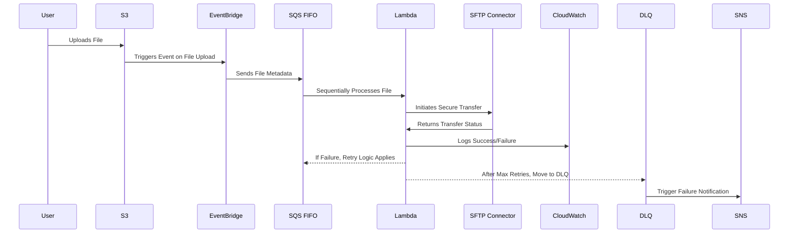

# SFTP Push File Transfer Solution Architecture Document

## Table of Contents
1. [Introduction](#introduction)
2. [System Overview](#system-overview)
3. [High-Level Architecture](#high-level-architecture)
4. [Detailed Workflow](#detailed-workflow)
5. [Components & AWS Services](#components--aws-services)
6. [Security Model](#security-model)
7. [Scalability Considerations](#scalability-considerations)
8. [Failure Handling & Retry Logic](#failure-handling--retry-logic)
9. [Assumptions & Constraints](#assumptions--constraints)
10. [Conclusion](#conclusion)

---

## 1. Introduction
### **Purpose**
This document describes the **Solution Architecture** for the **SFTP Push File Transfer System**, providing an in-depth understanding of the technical components, workflows, security considerations, and scalability aspects.

### **Scope**
- **Automates file transfer from AWS S3 to a remote SFTP server.**
- **Ensures sequential processing of files using SQS FIFO.**
- **Handles large files efficiently using multi-part uploads.**
- **Implements robust retry mechanisms for failure recovery.**

---

## 2. System Overview
The **SFTP Push File Transfer System** enables secure and automated file transfers from an **S3 bucket** to a remote **SFTP server** using **AWS Transfer Family**. It ensures **sequential processing**, integrates **error handling**, and logs activities for monitoring.

---

## 3. High-Level Architecture

```mermaid
graph TD;
    A[File Uploaded to S3] -->|EventBridge Trigger| B[Send Metadata to SQS FIFO]
    B -->|Sequential Processing| C[Lambda Reads from SQS]
    C -->|Process File| D[AWS Transfer Family - SFTP Connector]
    D -->|Transfer Successful| E[Mark as Transferred ✅]
    D -->|Transfer Failed| F[Retry Logic (Max 3 Attempts)]
    F -->|Max Retries Exceeded| G[Move to Dead Letter Queue ❌]
    G -->|Trigger Alert| H[SNS Notification 🚨]
```

### **Workflow Summary**:
1️⃣ **S3 EventBridge** triggers processing when a new file is uploaded.  
2️⃣ **SQS FIFO** ensures sequential processing.  
3️⃣ **Lambda reads from SQS** and triggers AWS Transfer Family.  
4️⃣ **Transfer success** → Logs success in CloudWatch.  
5️⃣ **Transfer failure** → Retry logic applies (Max 3 attempts).  
6️⃣ **Persistent failures** → Moved to **Dead Letter Queue (DLQ)** and alerts **SNS Notification**.

---

## 4. Detailed Workflow


---

## 5. Components & AWS Services

| Component | Purpose |
|-----------|---------|
| **Amazon S3** | Stores files before transfer. |
| **Amazon EventBridge** | Triggers file processing upon S3 event. |
| **Amazon SQS (FIFO Queue)** | Ensures files are processed in order. |
| **AWS Lambda** | Handles file transfer logic. |
| **AWS Transfer Family (SFTP Connector)** | Manages secure SFTP connections. |
| **AWS Secrets Manager** | Stores SFTP credentials securely. |
| **Amazon CloudWatch** | Logs transfer success, failures, and metrics. |
| **Amazon SNS** | Sends failure alerts for operational response. |

---

## 6. Security Model
### **IAM Policies**
- **Least Privilege Access:** Lambda can only access specific S3 buckets, SQS queues, and AWS Transfer Family.
- **IAM Role Separation:** Different IAM roles for **SFTP transfers** and **log monitoring**.

### **Encryption**
- **S3 Encryption:** SSE-KMS for data at rest.
- **SFTP Connection Encryption:** SSH-based secure transfer.
- **Secrets Management:** AWS Secrets Manager for storing credentials.

### **Network Security**
- **VPC Endpoint for S3 & Transfer Family** (if required for private SFTP servers).
- **Restrict public access via Security Groups and Firewall rules.**

---

## 7. Scalability Considerations
| Feature | Scaling Approach |
|---------|-----------------|
| **High File Volume** | SQS FIFO auto-scales to handle large queues. |
| **Concurrent Transfers** | AWS Transfer Family scales based on demand. |
| **Large File Handling** | Multi-part uploads for files **>5GB**. |
| **Failure Recovery** | Exponential backoff retry logic. |

---

## 8. Failure Handling & Retry Logic
### **Common Failures & Solutions**
| Failure Type | Handling Approach |
|-------------|------------------|
| **SFTP Transfer Failure** | 3 retry attempts with exponential backoff. |
| **Lambda Timeout** | Use **Step Functions** for large file handling. |
| **Permission Denied** | Verify **IAM policies** & **Secrets Manager permissions**. |
| **S3 File Missing** | Log missing file error and trigger **SNS alert**. |

---

## 9. Assumptions & Constraints
### **Assumptions**
- The **client's SFTP server** is reachable from AWS Transfer Family.
- IAM roles and policies follow **least privilege access**.
- The system needs to **process files sequentially**.

### **Constraints**
- S3 event notifications have **latency limitations**.
- Lambda execution time is **limited to 15 minutes**.
- Large file handling requires **multi-part uploads**.

---

## 10. Conclusion
This **Solution Architecture Document** defines how the **SFTP Push File Transfer** system ensures **secure, automated, and scalable** file transfers. With **sequential processing, retry handling, and failure recovery**, this approach guarantees **high reliability**.

---

### **Next Steps**:
Would you like **a Terraform script for full infrastructure automation? 🚀**

