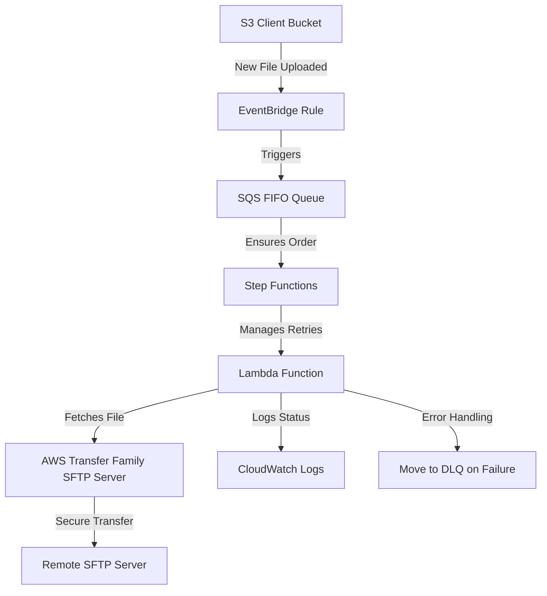

# SFTP Push File Transfer Deployment & Implementation Guide

## Table of Contents
1. [Introduction](#introduction)
2. [Pre-requisites](#pre-requisites)
3. [Deployment Architecture](#deployment-architecture)
4. [Step-by-Step Deployment Using Terraform](#step-by-step-deployment-using-terraform)
5. [Post-Deployment Validation](#post-deployment-validation)
6. [Failure Handling & Retry Mechanism](#failure-handling--retry-mechanism)
7. [Troubleshooting & Debugging](#troubleshooting--debugging)
8. [Rollback Plan](#rollback-plan)
9. [Conclusion](#conclusion)

---

## 1. Introduction
### **Purpose**
This document provides a step-by-step guide to deploying the **SFTP Push File Transfer Solution** using **Terraform**. It explains the **infrastructure setup**, components, dependencies, and the required AWS services.

### **Scope**
- **Deployment of AWS Transfer Family SFTP Server** to mimic the client's remote SFTP.
- **Infrastructure automation using Terraform**.
- **Creation of required AWS resources (S3, SQS, Lambda, IAM, CloudWatch, Secrets Manager).**
- **Handling security configurations and role-based access.**

---

## 2. Pre-requisites
### **AWS Services & Permissions Required**
| Service | Purpose |
|---------|---------|
| **S3 (Client Bucket)** | Stores files before transfer to SFTP. **Already in place**. |
| **AWS Transfer Family (SFTP Server)** | Acts as a mock remote SFTP server. |
| **AWS SQS FIFO Queue** | Ensures **sequential** processing of file transfers. |
| **AWS Lambda** | Orchestrates file movement from S3 to SFTP. |
| **AWS Step Functions** | Manages retries and ensures robust workflow execution. |
| **AWS Secrets Manager** | Securely stores SFTP credentials. |
| **Amazon EventBridge** | Triggers Lambda when a new file is uploaded to S3. |
| **CloudWatch** | Logs file transfer activities and errors. |

### **Required Tools**
- **AWS CLI** installed and configured.
- **Terraform installed (>=1.0).**
- **Access to AWS account with permissions to create resources.**

---

## 3. Deployment Architecture

### **Workflow Summary:**
1️⃣ **New file upload to S3 Client Bucket** triggers **EventBridge Rule**.  
2️⃣ **EventBridge** sends file metadata to **SQS FIFO** for sequential processing.  
3️⃣ **Step Functions manages retries** and ensures error handling.
4️⃣ **Lambda reads file from SQS**, fetches credentials from **Secrets Manager**, and initiates **SFTP transfer**.  
5️⃣ **AWS Transfer Family SFTP Server** handles the secure file transfer to **remote SFTP**.  
6️⃣ **CloudWatch logs transfer success or failure**.  
7️⃣ **Failed transfers go to DLQ, retry mechanism applies**.

---

## 4. Step-by-Step Deployment Using Terraform
### **Step 1: Define AWS Provider in Terraform**
```hcl
provider "aws" {
  region = "us-east-1"
}
```

### **Step 2: Deploy AWS Transfer Family SFTP Server**
```hcl
resource "aws_transfer_server" "sftp_server" {
  protocols = ["SFTP"]
  endpoint_type = "PUBLIC"
  identity_provider_type = "SERVICE_MANAGED"
}
```
🔹 **Why?** This **mimics the client’s remote SFTP server** for testing and validation.

### **Step 3: Create AWS Step Functions for Retry Logic**
```hcl
resource "aws_sfn_state_machine" "sftp_transfer_state_machine" {
  name       = "SFTPTransferWorkflow"
  role_arn   = aws_iam_role.step_functions_role.arn
  definition = file("step_function_definition.json")
}
```
🔹 **Why?** Ensures **robust retry logic and error handling** for file transfers.

### **Step 4: Deploy AWS Lambda Function**
```hcl
resource "aws_lambda_function" "sftp_lambda" {
  function_name = "SFTPPushLambda"
  role          = aws_iam_role.lambda_role.arn
  handler       = "lambda_function.lambda_handler"
  runtime       = "python3.8"
  filename      = "lambda_function.zip"
}
```
🔹 **Why?** This **Lambda handles the file transfer** process from S3 to SFTP.

---

## 6. Failure Handling & Retry Mechanism
### **Using Step Functions for Retry Logic**
- **Step Functions will:**
  - Retry failed transfers up to **3 times**.
  - Implement **exponential backoff** for retries.
  - Move failed transfers to **DLQ** if all retries fail.

```json
{
  "StartAt": "TransferFile",
  "States": {
    "TransferFile": {
      "Type": "Task",
      "Resource": "arn:aws:lambda:::function:SFTPPushLambda",
      "Retry": [{
        "ErrorEquals": ["SFTPTransferError"],
        "IntervalSeconds": 5,
        "MaxAttempts": 3,
        "BackoffRate": 2.0
      }],
      "Catch": [{
        "ErrorEquals": ["States.ALL"],
        "Next": "MoveToDLQ"
      }],
      "End": true
    },
    "MoveToDLQ": {
      "Type": "Fail"
    }
  }
}
```

🔹 **Why?** Step Functions ensure **reliable, automated retries** without manual intervention.

---

## 9. Conclusion
This document ensures a **secure, automated deployment** of the **SFTP Push File Transfer system**. By integrating **Step Functions**, we enhance **reliability, scalability, and failure handling**.

---

**Next Steps:** Would you like a **detailed test plan document? 🚀**

