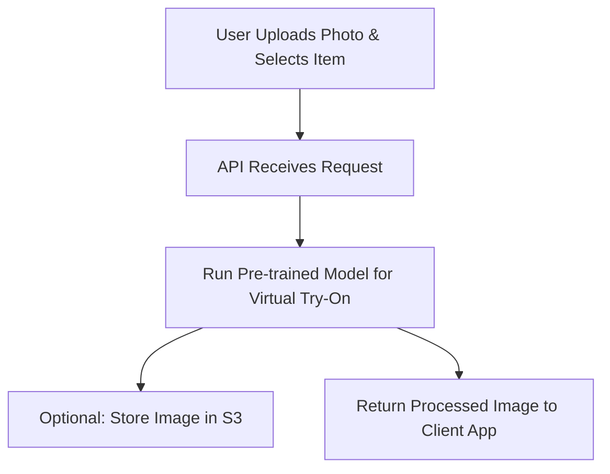

# Market and Opportunity Analysis

## Introduction
This document provides an overview of the market landscape, current players, and the potential opportunity for launching a virtual try-on service for the fashion e-commerce industry.

## Market Overview
- **Market Size (2024)**: The global virtual try-on market in the fashion industry is currently valued at several billion dollars and is projected to grow significantly over the next five years. Adoption is increasing, but it's still not universal, indicating room for new entrants.
- **Key Players**: While some major brands and tech companies (e.g., large e-commerce platforms and a few tech giants) have started to roll out virtual try-on features, many mid-sized and smaller retailers have not yet adopted it due to cost and complexity barriers.

## Opportunity Analysis
- **Why Now?**: As more consumers demand personalized shopping experiences and e-commerce competition grows, virtual try-ons can reduce return rates and increase customer satisfaction. There's a growing window of opportunity to offer a solution that’s easier to integrate for mid-sized retailers.
- **Market Gaps**: Current solutions can be expensive or technically challenging for smaller players. By providing a cost-effective, easy-to-implement API service, we can fill a niche that’s currently underserved.

## Conclusion
Entering the market now positions us to ride the wave of growing adoption and provide value to retailers looking for a more accessible solution. With the right execution, there is a strong potential to carve out a significant market share.

---

# Product Requirements Document (PRD)

## 1. Overview
This PRD outlines the virtual try-on service for fashion e-commerce platforms. The goal is to enable users to visualize how clothing items will look on them by uploading their own photos.

## 2. Objectives
- **User Experience**: Provide a seamless and intuitive way for users to see how clothes will fit.
- **Integration**: Offer a straightforward API that partner retailers can integrate into their websites.
- **Scalability**: Ensure the service can handle multiple requests efficiently.

## 3. Key Features
- **Image Upload and Processing**: Users upload their photos, and the service generates a composite image with the selected clothing item.
- **API Endpoints**: Provide RESTful API endpoints for uploading photos, selecting items, and retrieving results.
- **Admin and Analytics Dashboard**: (Optional) Dashboard for tracking usage and performance metrics.

## 4. Technical Requirements
- **Tech Stack**: Python for backend, Flask/FastAPI for the API, AWS for hosting, and TensorFlow or PyTorch for the ML models.
- **Model Management**: Use pre-trained computer vision models downloaded and hosted locally.
- **Security and Privacy**: Ensure secure handling of user-uploaded images and compliance with privacy regulations.

## 5. User Workflow
1. **User Selects Clothing Item**: On the partner's site, the user chooses an item and clicks "Try On."
2. **User Uploads Photo**: The user uploads their photo, which is sent to the API.
3. **API Processes Image**: The API uses the ML model to create the virtual try-on image.
4. **Result Displayed**: The partner site displays the resulting image to the user.

## 6. Milestones and Timeline
- **Phase 1: POC Development**: Build and test a working proof of concept (4–6 weeks).
- **Phase 2: Beta Integration**: Integrate with a pilot partner and gather feedback (3–4 weeks).
- **Phase 3: Full Launch**: Roll out to additional partners and scale the service (ongoing).

---

# Technical Architecture and Workflow

## 1. System Architecture Overview
This document provides a technical blueprint of the virtual try-on service, including the overall architecture, components, and data flow.

## 2. High-Level Architecture
- **Backend**: Python application using Flask or FastAPI to serve the API.
- **ML Models**: Pre-trained computer vision models (e.g., TensorFlow or PyTorch) hosted locally on the server.
- **Cloud Infrastructure**: AWS EC2 for hosting the application, S3 for storing images, and optionally AWS Lambda for serverless execution.

## 3. Component Breakdown
- **API Layer**: Handles incoming requests from partner front-ends, processes images, and returns results.
- **Model Inference Service**: Loads the pre-trained model into memory, applies the virtual try-on logic, and generates the composite image.
- **Storage and Data Management**: S3 bucket for temporarily storing user images and results if needed.

## 4. Workflow Steps
1. **Image Upload**: The partner front-end sends a POST request to the `/upload` endpoint with the user's photo and selected clothing item ID.
2. **Processing Request**: The backend receives the image, runs the model inference to overlay the clothing onto the user’s image.
3. **Returning Results**: The processed image is returned to the front-end as a URL or directly as image data.
4. **Display to User**: The partner site displays the resulting image back to the user.

## 5. Deployment and Scaling
- **Deployment**: Use AWS EC2 instances for the initial deployment. Optionally, consider Docker containers for easier scaling.
- **Scaling**: As demand grows, use AWS Auto Scaling groups or Kubernetes to manage additional instances and ensure high availability.

---

# Team and Skills Requirements

## 1. Overview
This document outlines the roles and skills needed to build and launch the virtual try-on service.

## 2. Key Roles

### Machine Learning Engineer
- Responsibilities: Fine-tune and manage pre-trained computer vision models, integrate them into the application, and optimize inference performance.
- Skills Needed: Experience with TensorFlow or PyTorch, computer vision expertise, and familiarity with pre-trained model fine-tuning.

### Backend Developer
- Responsibilities: Develop the API layer, handle image processing requests, and ensure secure data handling.
- Skills Needed: Proficiency in Python, experience with Flask or FastAPI, and knowledge of RESTful API design.

### DevOps/Cloud Engineer
- Responsibilities: Set up and maintain AWS infrastructure, manage deployments, and ensure scalability and reliability.
- Skills Needed: Experience with AWS services (EC2, S3, Lambda), containerization (Docker), and infrastructure as code.

## 3. Additional Roles (Optional)

### Frontend Developer
- Responsibilities: Build demo interfaces or sample integrations to showcase the API.
- Skills Needed: Knowledge of web development (HTML, CSS, JavaScript) and integrating with RESTful APIs.

### Project Manager
- Responsibilities: Coordinate tasks, manage timelines, and ensure communication across the team.
- Skills Needed: Experience with agile methodologies and project management tools (Jira, Trello).

## 4. Team Structure and Collaboration
- Use a Git repository for version control.
- Conduct regular stand-ups and sprint planning.
- Maintain documentation in Markdown format.

---

# Visual Diagrams

## Business Flow Diagram

## Technical Workflow Diagram

